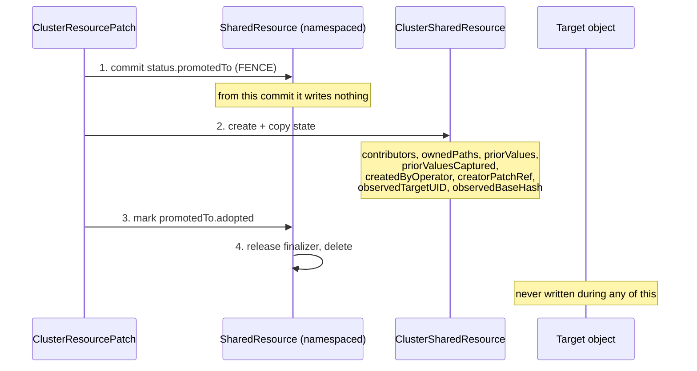

# Promotion

A namespaced target tracked by a `SharedResource` acquires its first `ClusterResourcePatch`
contributor. Rule 3 of the [scope model](scope-model.md#tracker-selection) says a
`ClusterSharedResource` must now own it.

!!! info "Why the tracker kind has to change"
    A namespaced tracker cannot count a contributor outside its namespace — and **an incomplete
    reference count deletes objects that are still in use.**

The migration is **one-way** and must never leave two trackers able to write to one object.

## The protocol

The order is the whole safety argument.



1. **Fence first.** Commit `status.promotedTo` on the namespaced tracker. From that commit it writes
   nothing. **This lands before the successor exists.** Ordering these the other way round is the
   one way to get two writers on one object.
2. **Create the successor**, copying the state below.
3. **Mark the promotion adopted.**
4. **Only then** release the namespaced tracker's finalizer and delete it.

Existing `ResourcePatch` contributors follow `promotedTo`, re-register on the cluster tracker, and
update `status.sharedResourceRefs`. Their contributions are never re-applied or reverted — **nothing
about the target changes during a promotion.**

## What the copy carries, and why

Two parts are load-bearing rather than incidental:

!!! danger "Losing `priorValues` would silently break revert"
    For every existing contributor under ClientSideApply, fields would be **deleted** on release
    instead of restored to what they held before.

!!! danger "Losing `createdByOperator` / `creatorPatchRef` would silently break delete-safety"
    The successor would no longer know that it created the object, or which contributor created it —
    and the ["only the creator may delete"](lifecycle.md#releasing-the-last-contributor) guarantee
    would evaporate at exactly the moment the contributor set became cross-namespace.

The copy **merges** rather than overwrites: the successor may already have computed its own
contributor list, and clobbering it would be a regression. Fields the successor can derive for
itself are left alone; fields only the predecessor knows are carried over.

## Crash recovery

Every step is idempotent, so a crash resumes rather than corrupts.

| State on restart | Recovery |
|---|---|
| Fenced, **no** successor | Unfence and retry. Leaving it fenced would leave the target with no writer at all. |
| Fenced, successor exists, not adopted | Re-copy the state and flag adoption. |
| Fenced, adopted | Release the finalizer and delete the old tracker. |

Adoption is keyed off the **fence's `adopted` flag**, not off the successor's existence. That
distinction matters: the arriving `ClusterResourcePatch`'s normal path also creates the cluster
tracker, so the successor may already exist by the time promotion runs. An early return on "it
exists" would leave the successor with an empty status — which its own controller would then partly
repopulate from a live list, hiding the loss of exactly the state that cannot be re-derived.

!!! note "Promotion reads uncached"
    The informer cache is eventually consistent, so a cached read of an object created moments
    earlier returns `NotFound`, and a stale read writes the fence against an old `resourceVersion`
    and loses it. The fence's correctness is the whole safety argument, so it does not get to depend
    on cache timing.

## Never demoted

When the last `ClusterResourcePatch` leaves, the `ClusterSharedResource` **stays** and keeps
tracking the namespaced target. Demotion would be a second migration with all the same hazards for
no user-visible benefit.

A related consequence: once a `ClusterSharedResource` owns a namespaced target, namespaced
contributors **join it** rather than standing up a `SharedResource` beside it. Without that, a
namespaced contributor would recreate the retired tracker the moment promotion deleted it,
resurrecting the second writer the promotion existed to remove.

## What promotion does not change

The `ResourcePatch`es are unchanged and still namespaced. **They did not become privileged by being
promoted** — they still cannot name a target outside their own namespace. Only the bookkeeping
moved.

## Observing it

```bash
# During promotion
kubectl get sharedresource -n team-a <name> -o jsonpath='{.status.promotedTo}'
# {"name":"configmap-team-a-shared-a1b2c3","adopted":true}

# Afterwards: the namespaced tracker is gone
kubectl get sharedresources -n team-a
kubectl get clustersharedresources
```
